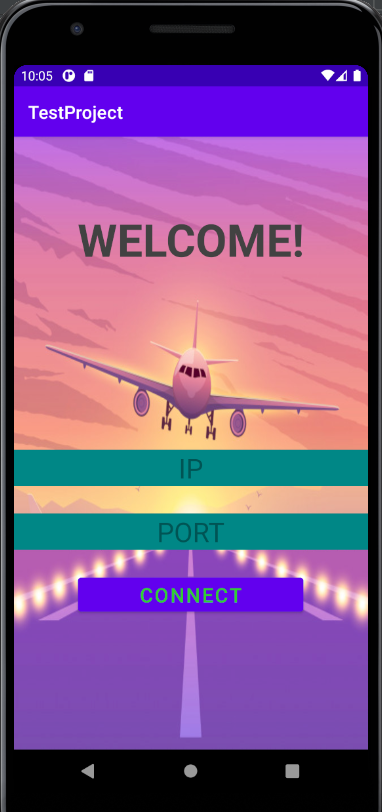
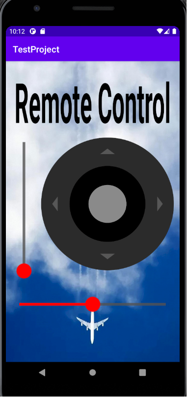

# RemoteControlAndroidApp
An android app that controls a flight that takes place on Flight Gear simulator application.

## Motivation

RemoteControlAndroidApp is a final task of our programing course in university.

This app is especially useful for users who want to practice controlling an airplane using a joystick on Flight gear Apllication,
and ofcourse using the app in their android phone.

## Tech/framework used

**Built with**
* Android Studio

*Based on Kotlin, Java*

## Compile and run
To download and set up 'RemoteControlAndroidApp' application in Android Studio, follow this steps:

**1.** Download RemoteControlAndroidApp from GitHub: 
 * You can use one of the following two options-  
   * "Download ZIP" button 
   * CMD: git clone https://github.com/TsahiElhadad/RemoteControlAndroidApp.git

2. Import the project in Android studio:  
 **2.1.** Click **File** -> **New** -> **Import project**  
 **2.2.** Navigate to the directory where you downloaded the RemoteControlAndroidApp repository *(usually: Users\current_user\RemoteControlAndroidApp)*  
 **2.3.** Select the "RemoteControlAndroidApp" folder and click ok  
 **2.4.** Android Studio may prompt you to install the latest version of various Android libraries.  
 Click "Install Repository and sync project" and follow the instructions.

**3.** Connect your device over USB. You should see a notification that says ‘USB Debugging Enabled’    
**4.** **Run** the app either by clicking the green arrow in the bar, or go to Run > Run 'app'  

## How to use?

**1.** First, compile and run the RemoteControlAndroidApp like descripted above.  

2. On your computer open Flight Gear Application  
  **2.1** Click on Setting option  
  **2.2** On the Additional Setting option copy this line: --telnet=socket,in,10,127.0.0.1,6400,tcp  
  **2.3** On the line you copyied, choose the port you want to run on it(now it's port: 6400 and you can replace it).  

**3.** Click on run option in Flight Gear application and wait for the airplane be reset on the runway.  

**4.** On the RemoteControlAndroidApp, choose the correct IP and PORT of your computer that run Flight gear App,  
       ofcourse use the port you write in the additional setting option in Flight Gear App.  
       Finally, press connect.  
       
**5.** If the connect succeeded, you will move to the joystick window and you can start to fly :)  

